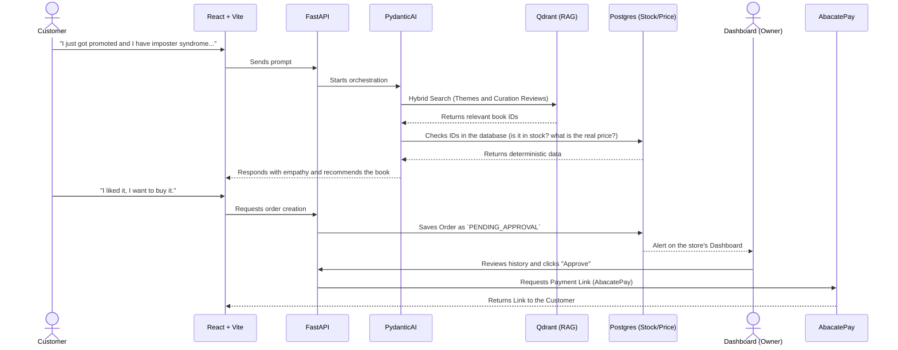

# Livraria Ágora AI Agent

Welcome to the **Ágora Librarian** repository, an artificial intelligence-guided customer service and sales system for Livraria Ágora. 

This project is not a demo chatbot. It is a product focused on solving a real consultative retail problem: customers searching for books based on life dilemmas, career transitions, or emotional needs, rather than by specific titles or authors.

---

## Project Architecture

The system was designed by separating the conversational intelligence (LLM) from the transactional truth (Database). The AI recommends, but the rigid system dictates the price, stock, and approval.

Below is the flow of how the system is sustained and where human approval comes in:



---

**What happens when something fails?**
If the customer asks for something outside the domain (e.g., a cake recipe) or if Qdrant does not return matches with a minimum score, the Agent has a programmed fallback to politely inform that its specialty is literary curation and suggest popular store themes.

---

## Repository Structure

The project follows a structured monorepo pattern to facilitate local execution via Docker:

*   `docs/`: Live project documentation (MkDocs).
*   `backend/`: FastAPI API, PydanticAI agents, and instrumentation with Logfire.
*   `frontend/`: Customer chat interface and approval dashboard in React + Vite.
*   `infra/`: `docker-compose.yml`, files, Qdrant configurations, and fake database.
*   `.antigravity.md` / `CONTEXT.md`: Business rules and constraints for code agents.

---

## The Agent Harness: Antigravity

To build this project, the chosen Harness was Antigravity. Knowing how to direct a code agent is fundamental to keeping the scope safe and the architecture clean.

### 1. Why Antigravity?
The choice is based on its ability to iterate over the repository while respecting the defined global context. It allows for a fluid transition between generating extensive boilerplates and fine refactoring.

### 2. The Agent Context (`CONTEXT.md`)
The repository has a master context file that the agent must read before acting. The main rules include:

- **Zero Price Hallucination:** The code agent is strictly prohibited from creating logic where the LLM invents prices. All pricing comes from DB dependency injection.
- **Strict Typing:** Mandatory use of Pydantic v2 for all input and output schemas, ensuring that PydanticAI always returns valid JSONs to the frontend.
- **Immutable Frontend:** Exclusive use of Functional Components and Hooks in React.

### 3. What is automated and what is manual?
*   **Automated for the Agent:** Creation of basic CRUD *endpoints*, UI component generation using Tailwind, and writing unit tests for deterministic functions.
*   **Deliberately Manual:** Approval of *Pull Requests* to the `main` *branch*, configuration of payment routes (AbacatePay), and the final editing of the PydanticAI *System Prompt* (as it dictates the tone and personality of the Librarian).

### 4. How is the code reviewed?
No changes go to the `main` *branch* without reviewing the *diff*. In addition to syntactic review, the AI's behavior is reviewed using **Logfire** to inspect the PydanticAI execution *Spans*, ensuring that the semantic search in Qdrant is consuming the expected tokens and returning the correct *queries*.

---

## How to run it (Development)

So the team can test the product locally without friction:

1.  Clone the repository.
2.  Configure your keys in the `.env` file (Groq API Key, Logfire Token, AbacatePay Dev Token).
3.  Run the command below:

```bash
docker compose up -d
```

*Docker will spin up Qdrant, the FastAPI backend, and the React frontend. The database will be automatically populated with the fake library script in Python on the first initialization.*