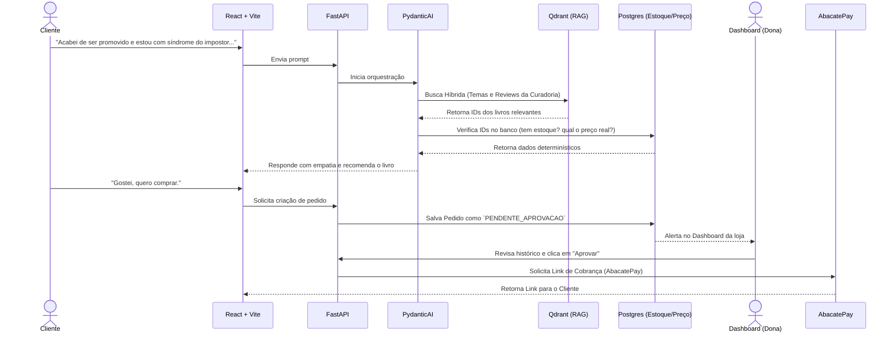

# Livraria Ágora AI Agent

Bem-vindo ao repositório do **Bibliotecário Ágora**, um sistema de atendimento e vendas guiado por inteligência artificial para a Livraria Ágora. 

Este projeto não é um chatbot de demonstração. É um produto focado em resolver um problema real de varejo consultivo: clientes que buscam livros baseados em dilemas de vida, transições de carreira ou necessidades emocionais, e não por títulos ou autores específicos.

---

## Arquitetura do Projeto

O sistema foi desenhado separando a inteligência conversacional (LLM) da verdade transacional (Banco de Dados). A IA recomenda, mas quem dita o preço, o estoque e a aprovação é o sistema rígido.

Abaixo, o fluxo de como o sistema se sustenta e onde entra a aprovação humana:



**O que acontece quando algo falha?**
Se o cliente pedir algo fora do domínio (ex: receita de bolo) ou se o Qdrant não retornar matches com pontuação mínima, o Agente possui um *fallback* programado para informar educadamente que sua especialidade é a curadoria literária e sugerir temas populares da loja.

---

## Estrutura do Repositório

O projeto segue um padrão de monorepo estruturado para facilitar a execução local via Docker:

*   `docs/`: Documentação viva do projeto (MkDocs).
*   `backend/`: API em FastAPI, agentes em PydanticAI, e instrumentação com Logfire.
*   `frontend/`: Interface do chat do cliente e do dashboard de aprovação em React + Vite.
*   `infra/`: Arquivos `docker-compose.yml`, configurações do Qdrant e banco de dados *fake*.
*   `.antigravity.md` / `CONTEXT.md`: Regras de negócio e restrições para agentes de código.

---

## O Agent Harness: Antigravity

Para construir este projeto, o *Harness* escolhido foi o **Antigravity**. Saber dirigir um agente de código é fundamental para manter o escopo seguro e a arquitetura limpa.

### 1. Por que Antigravity?
A escolha se baseia na sua capacidade de iterar sobre o repositório enquanto respeita o contexto global definido. Ele permite uma transição fluida entre a geração de *boilerplates* extensos e a refatoração fina.

### 2. O Contexto do Agente (`CONTEXT.md`)
O repositório possui um arquivo mestre de contexto que o agente obrigatoriamente lê antes de atuar. As regras principais incluem:
*   **Zero Alucinação de Preço:** O agente de código está proibido de criar lógicas onde o LLM invente preços. Toda precificação vem de injeção de dependência do DB.
*   **Tipagem Estrita:** Uso obrigatório do Pydantic v2 para todos os *schemas* de entrada e saída, garantindo que o `PydanticAI` sempre retorne JSONs válidos para o frontend.
*   **Frontend Imutável:** Uso exclusivo de *Functional Components* e *Hooks* no React.

### 3. O que está automatizado e o que é manual?
*   **Automatizado para o Agente:** Criação de *endpoints* CRUD básicos, geração de componentes de UI a partir do Tailwind, e escrita de testes unitários para funções determinísticas.
*   **Deliberadamente Manual:** Aprovação de *Pull Requests* para a *branch* principal, configuração de rotas de pagamento (AbacatePay), e a edição final do *System Prompt* do PydanticAI (pois dita o tom e a personalidade do Bibliotecário).

### 4. Como o código é revisado?
Nenhuma mudança vai para a *branch* `main` sem revisão do *diff*. Além da revisão sintática, o comportamento da IA é revisado usando o **Logfire** para inspecionar os *Spans* de execução do PydanticAI, garantindo que a busca semântica no Qdrant esteja consumindo os tokens esperados e retornando as *queries* corretas.

---

## Como colocar para rodar (Desenvolvimento)

Para que a equipe consiga testar o produto localmente sem fricção:

1.  Clone o repositório.
2.  Configure suas chaves no `.env` (Groq API Key, Logfire Token, AbacatePay Dev Token).
3.  Execute o comando abaixo:

```bash
docker compose up -d
```

*O Docker subirá o Qdrant, o backend FastAPI e o frontend React. O banco será populado automaticamente com o script de biblioteca fake em Python na primeira inicialização.*